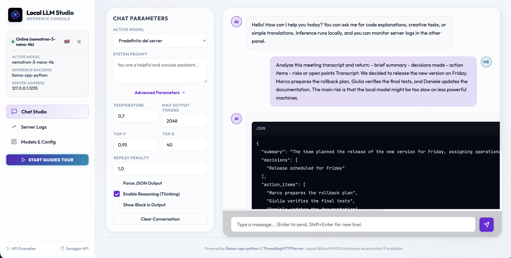
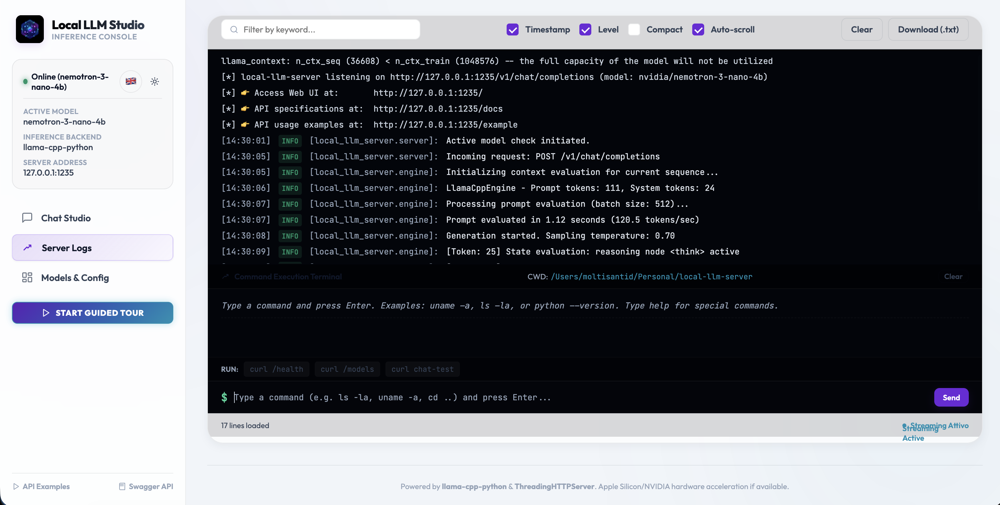
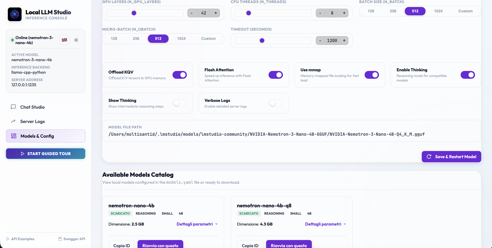
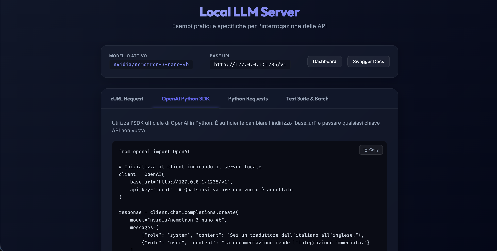
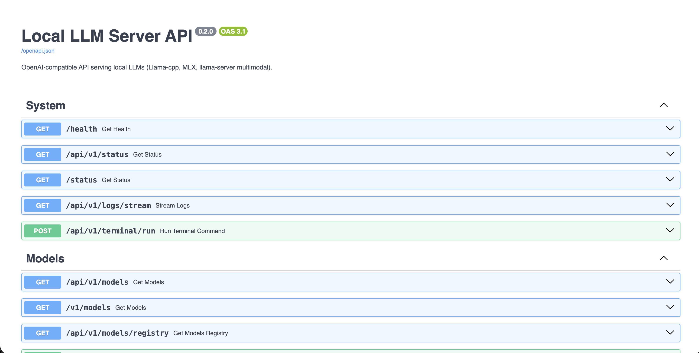

# local-llm-server

Self-contained local LLM server with an OpenAI-compatible API, CLI, Python API, interactive Web UI, and multimodal image/audio helpers.

`local-llm-server` is a local inference server designed to let desktop and local-first applications use Large Language Models without depending on external cloud APIs. It abstracts local inference engines (`llama-cpp-python`, `mlx-lm`, `llama-server`, and `mlx-vlm`) behind a stable, observable, and easy-to-use interface.

It can serve:
- **GGUF text models** in-process through `llama-cpp-python`.
- **MLX models** through `mlx-lm` (optimized for Apple Silicon).
- **Multimodal image models** through `mlx_vlm.server`, using complete MLX VLM packages without a separate projector.
- **GGUF multimodal/audio models** through an external `llama-server` subprocess with `--mmproj`.

---

## Interactive Demo & Web UI Gallery

### Guided Tour Demo
Watch the interactive guided tour showing how to use the dashboard, configure parameters, run local model inference, and monitor server logs in real-time:

<video src="docs/assets/local-llm-server%20demo.mp4" width="100%" controls alt="local-llm-server demo"></video>

*(Can't play the video? [Watch/Download the Demo Video directly](docs/assets/local-llm-server%20demo.mp4))*

### Web UI & API Gallery

<table width="100%">
  <tr>
    <td width="50%" valign="top">
      <h4>1. Interactive Chat Studio (Playground)</h4>
      <p>A fully-featured chat interface to test model reasoning, adjust temperature, customize the system prompt, and toggle thinking mode.</p>
      
    </td>
    <td width="50%" valign="top">
      <h4>2. Live Server Logs & Telemetry</h4>
      <p>Monitor real-time server activity, model loading states, and generation statistics (tokens/second) streamed directly over SSE.</p>
      
    </td>
  </tr>
  <tr>
    <td width="50%" valign="top">
      <h4>3. Model Registry & Configuration</h4>
      <p>Browse available models, track download statuses, configure hardware settings (e.g., CPU threads, GPU layers), and hot-swap active models at runtime.</p>
      
    </td>
    <td width="50%" valign="top">
      <h4>4. Built-in Interactive Examples</h4>
      <p>Interactive, copy-pasteable client code snippets (Python SDK, cURL, etc.) for rapid integration.</p>
      
    </td>
  </tr>
  <tr>
    <td width="50%" valign="top">
      <h4>5. OpenAPI/Swagger Documentation</h4>
      <p>Self-documenting interactive API playground listing all runtime endpoints and schemas.</p>
      
    </td>
    <td width="50%"></td>
  </tr>
</table>

---

## Table of Contents

- [Interactive Demo & Web UI Gallery](#interactive-demo--web-ui-gallery)
1. [Why This Project Exists (Philosophy)](#1-why-this-project-exists-philosophy)
2. [Core Features](#2-core-features)
3. [Architecture & Ecosystem Integration](#3-architecture-ecosystem-integration)
4. [Requirements & Installation](#4-requirements-installation)
5. [Quick Start](#5-quick-start)
6. [CLI Reference](#6-cli-reference)
7. [Built-in Models Registry](#7-built-in-models-registry)
8. [Configuration](#8-configuration)
9. [Python API & Client SDK](#9-python-api-client-sdk)
10. [HTTP API Reference](#10-http-api-reference)
11. [Security, Privacy, and VM Access](#11-security-privacy-and-vm-access)
12. [Development & Testing](#12-development-testing)
13. [Project Status & Roadmap](#13-project-status-roadmap)
14. [License](#14-license)

---

## 1. Why This Project Exists (Philosophy)

The primary objective of `local-llm-server` is to enable the use of **open-weights LLMs completely offline and locally**.

This initiative is driven by key observations and principles:
- **90% of Common LLM Tasks Can Be Handled Locally**: Common tasks such as summarizing meeting transcripts, extracting action items, parsing structured data, or generating titles do not require massive cloud-based APIs.
- **High Efficiency of Small, Specialized Models**: Small local models (such as `nvidia-nemotron-3-nano-4b` or `phi-3-mini`) provide highly effective and accurate responses when applied to well-defined, narrow contexts.
- **Absolute Privacy**: Sensitive data (such as internal business documents, personal notes, or meeting transcripts) never leaves the user's machine.
- **Zero Operating Costs**: No recurring API usage costs or token-based billing.
- **Offline Reliability & Low Latency**: Work without internet connections and avoid network roundtrip latencies.

---

## 2. Core Features

- **OpenAI-Compatible Endpoint**: Drop-in `/v1/chat/completions` API.
- **Built-in Web UI**: A beautiful local dashboard (`http://127.0.0.1:1235/`) for chatting, listing models, viewing server telemetry, and streaming logs.
- **Flexible Backend Support**: Support for `llama-cpp-python` (GGUF), Apple Silicon-optimized `mlx-lm`, `mlx-vlm` for MLX vision models, and external `llama-server` for GGUF multimodal models.
- **Runtime Model Switching**: Dynamically activate and switch models via API endpoints without restarting the server process.
- **Concurrent Resident Models**: Keep multiple engines in memory and route requests by the OpenAI `model` field through one public port.
- **Observability**: Real-time token generation telemetry, status updates, and SSE-based log streaming.
- **Python Client SDK**: High-level wrappers for structured analysis and audio/multimodal processing.
- **CLI Utilities**: Simple commands to download, list, and serve models.

---

## 3. Architecture & Ecosystem Integration

### System Architecture

The server acts as a stable runtime layer between downstream applications and fragmented local LLM engines:

```
[ Local Application (e.g. ClosedRoom) ]
                 │
                 ▼ (OpenAI-compatible HTTP API / Python SDK)
      [ local-llm-server ]
                 │
                 ▼ (Dynamic loading / Orchestration)
    [ Local Inference Backends ]
 ┌───────────────────────┬─────────────┬─────────────────┬──────────────────┐
 │ llama-cpp-python      │ mlx-lm      │ llama-server    │ mlx-vlm.server   │
 │ (GGUF Text)           │ (Apple MLX) │ (GGUF multimodal)│ (MLX vision)    │
 └───────────────────────┴─────────────┴─────────────────┴──────────────────┘
```

All clients use the same public endpoint. Subprocess ports are private implementation details assigned uniquely per resident runtime:

```text
POST :1235/v1/chat/completions
  model=nemotron-nano-4b-q8  -> llama-cpp-python
  model=qwen3-vl-4b          -> mlx_vlm.server on a private port
  model=another-gguf         -> llama-server on another private port
```

`ModelRuntimeManager` is the sole owner of resident engines. Each inference
request acquires a runtime lease before entering the backend admission lock;
`unload`, `reload`, and shutdown cannot close an engine while that lease is
active. The CLI or Python server handle owns process signals and final shutdown,
while engine adapters only own inference and their direct subprocess.
Admission uses a per-runtime semaphore configured by `max_concurrent_requests`;
lifecycle leases and backend concurrency are therefore independent.
External backends compose a shared `ManagedProcess` for immediate log draining,
readiness checks, bounded log tails, and process-group terminate/kill cleanup. Engine adapters
expose separate `complete(payload)`, `stream(payload)`, and `close()` operations.
`create_app()` builds isolated FastAPI instances, so embedding two servers does
not share runtime state.

### Example: Integration with ClosedRoom

**ClosedRoom** is a local-first meeting application that records, transcribes, and analyzes meetings on-device. `local-llm-server` serves as ClosedRoom's local reasoning and analysis layer:

```
[ ClosedRoom UI / App ] ──(Audio Recording)──► [ local-asr-server ]
         ▲                                             │
         │ (Structured summary / actions)              ▼ (Transcript)
         └────────────────────────────────────── [ local-llm-server ]
                                                       │
                                                       ▼
                                            (Local Model Inference)
```

By decoupling model loading, GPU layer offloading, and backend management into `local-llm-server`, ClosedRoom remains lightweight and focused solely on product experience.

---

## 4. Requirements & Installation

- **Python**: `>= 3.10`
- **Compiler**: A C/C++ compiler on your system to build `llama-cpp-python` (if installing from source).
- **OS**: macOS or Linux.

### Install from Source / Development
```bash
# Basic installation (includes llama-cpp-python backend)
pip install .

# For development setup (includes pytest and tools)
pip install ".[dev]"
```

### Install Optional Backends & Helpers
```bash
# Apple Silicon MLX backend
pip install ".[mlx]"

# Apple Silicon vision-language backend (Qwen3-VL MLX)
pip install ".[vision]"

# Audio preprocessing libraries (required for Voxtral and client audio helpers)
pip install ".[audio]"
```

### Standalone Wheel Installation
If you generated a pre-built wheel (e.g., via the deploy script):
```bash
pip install local_llm_server-*.whl
```

---

## 5. Quick Start

### 1. List Available Models
Print the built-in model registry and check which models are already downloaded:
```bash
local-llm models
```

### 2. Start the Server
Start serving a model (e.g., Qwen 3 8B or Nemotron Nano):
```bash
local-llm serve --model qwen3-8b
```
The default server URL is `http://127.0.0.1:1235`. Once started, you can access:
- **Web UI dashboard**: `http://127.0.0.1:1235/`
- **API examples**: `http://127.0.0.1:1235/example`
- **Swagger API Docs**: `http://127.0.0.1:1235/docs`

### 3. Send an API Request
Send a request using standard OpenAI API formats:
```bash
curl http://127.0.0.1:1235/v1/chat/completions \
  -H "Content-Type: application/json" \
  -d '{
    "model": "qwen3-8b",
    "messages": [{"role": "user", "content": "Hello!"}]
  }'
```

Or using the OpenAI Python SDK:
```python
from openai import OpenAI

client = OpenAI(base_url="http://127.0.0.1:1235/v1", api_key="local")
response = client.chat.completions.create(
    model="qwen3-8b",
    messages=[{"role": "user", "content": "Hello!"}],
)
print(response.choices[0].message.content)
```

---

## 6. CLI Reference

### `local-llm serve`
Start the inference server.

| Flag | Default | Description |
|---|---:|---|
| `--model <key>` | registry `default_model` | Registry model key |
| `--models <key...>` | registry `startup_models` | Models to keep resident simultaneously |
| `--default-model <key>` | first startup model | Route used when a request omits `model` |
| `--model-path <path>` | - | Direct GGUF path, MLX path, or HF model ref |
| `--backend <backend>` | registry/backend fallback | `llama_cpp`, `mlx`, `llama_server`, or `mlx_vlm_server` |
| `--host <host>` | `127.0.0.1` | Bind address |
| `--port <port>` | `1235` | Public HTTP port |
| `--ctx-size <n>` | model default | Context window size |
| `--n-gpu-layers <n>` | model default | GPU-offloaded layers |
| `--n-threads <n>` | `8` | CPU inference threads |
| `--llama-server-port <n>` | `8091` | Internal subprocess port for `llama_server` backend |
| `--llama-server-bin <path>` | auto-detect | Path to `llama-server` executable |
| `--mlx-vlm-server-port <n>` | `8092` | Internal subprocess port for `mlx_vlm.server` |
| `--mmproj-path <path>` | registry/auto-detect | Multimodal projector GGUF |
| `--startup-timeout <s>` | `60` | `llama-server` readiness timeout |
| `--max-concurrent-requests <n>` | model default (`1`) | Same-model requests admitted concurrently |
| `--chat-format <fmt>` | model default | llama.cpp chat format override |
| `--force-json / --no-force-json` | `false` | Request JSON output by default |
| `--enable-thinking / --no-enable-thinking` | model default | Enable thinking mode |
| `--show-thinking / --no-show-thinking` | `false` | Include `<think>` blocks in output |
| `--no-download` | `false` | Fail if model is not already downloaded |
| `--verbose` | `false` | Verbose logging |
| `--enable-admin-api` | `false` | Enable model management, registry, and log-stream endpoints |
| `--cors-origin <origin>` | disabled | Allow one browser origin; repeat for multiple origins |

For the full local dashboard, enable the administrative surface explicitly:

```bash
local-llm serve --model qwen3-8b --enable-admin-api
```

CORS is disabled by default. Enable only the origins that host a separate browser
frontend, for example `--cors-origin http://127.0.0.1:3000`.

### `local-llm models`
Print the merged built-in and user model registry, including backend and download status.

Start two resident models behind the same public port:

```bash
local-llm serve \
  --models nemotron-nano-4b-q8 qwen3-vl-4b \
  --default-model nemotron-nano-4b-q8 \
  --port 1235
```

In the Web UI, open **Modelli e Config**. Each catalog entry exposes the action appropriate to its current state:

- **Carica in memoria** keeps the existing runtimes active;
- **Imposta predefinito** changes the route used when chat requests omit `model`;
- **Scarica memoria** removes one idle runtime;
- **Configurazione avanzata** always identifies the selected resident runtime before applying context, GPU, batch, and thinking controls.

The Chat model selector lists resident models only, preventing requests to unloaded runtimes.

Configuration is capability-driven. The backend is fixed by the model registry and is displayed read-only; the UI sends only settings consumed by that engine:

| Backend | Configurable runtime settings |
|---|---|
| `llama_cpp` | context, GPU layers, threads, batch/micro-batch, timeout, KQV offload, Flash Attention, mmap, thinking |
| `llama_server` | context, timeout, thinking |
| `mlx` | thinking |
| `mlx_vlm_server` | timeout, thinking |

Model path and backend are runtime identity fields, not editable tuning controls.

Requests select a runtime using the registry key or model ID:

```json
{
  "model": "qwen3-vl-4b",
  "messages": [{"role": "user", "content": "Describe this image"}]
}
```

### `local-llm download <key>`
Pre-download all artifacts for a registry model without starting the server.
GGUF multimodal models download the language model and `mmproj`; MLX repositories
are downloaded into the standard Hugging Face cache.
```bash
local-llm download qwen3-vl-4b
```

---

## 7. Built-in Models Registry

| Key | Backend | Parameters | Size | Tags | Description |
|---|---|---:|---:|---|---|
| `nemotron-nano-4b` | `llama_cpp` | 4B | ~2.5 GB | reasoning, small | NVidia reasoning model, fast and efficient |
| `nemotron-nano-4b-q8` | `llama_cpp` | 4B | ~4.3 GB | reasoning, small | NVidia reasoning model, 8-bit quantized |
| `qwen3-vl-4b` | `mlx_vlm_server` | 4B | ~2.9 GB | multimodal, vision, small | Hugging Face Qwen3-VL MLX 4-bit repository; vision encoder and processor are included |
| `qwen3-8b` | `llama_cpp` | 8B | ~4.9 GB | reasoning, medium | Highly capable generalist model |
| `phi-3-mini` | `llama_cpp` | 3.8B | ~2.3 GB | instruct, small | Lightweight, fast instruction follower |
| `qwen2.5-7b` | `llama_cpp` | 7B | ~4.4 GB | instruct, medium | Balanced capacity instruction follower |
| `voxtral-mini-3b` | `llama_server` | 3B | ~3.8 GB | multimodal, audio, small | Audio/text multimodal processing |

> [!NOTE]
> `qwen3-vl-4b` defaults to `mlx-community/Qwen3-VL-4B-Instruct-4bit` and is
> resolved through the Hugging Face cache, independently of LM Studio. This MLX
> package includes the vision encoder and projector, so it does not use a
> separate `mmproj` file. GGUF multimodal models still require both artifacts.

The merged built-in/user registry is validated before startup. Invalid aliases,
unsupported backends, invalid ports or concurrency, inconsistent modalities, and
missing VLM/GGUF multimodal artifacts fail early with a descriptive error.

---

## 8. Configuration

### Environment Variables
All major CLI flags have matching environment variables:

| Variable | Description |
|---|---|
| `LOCAL_LLM_HOST` | Bind host |
| `LOCAL_LLM_PORT` | Public HTTP port |
| `LOCAL_LLM_BACKEND` | Backend override |
| `LOCAL_LLM_CTX_SIZE` | Context window size |
| `LOCAL_LLM_N_GPU_LAYERS` | GPU layers |
| `LOCAL_LLM_N_THREADS` | CPU threads |
| `LOCAL_LLM_N_BATCH` | Batch size |
| `LOCAL_LLM_N_UBATCH` | Micro-batch size |
| `LOCAL_LLM_CHAT_FORMAT` | Chat format |
| `LOCAL_LLM_FORCE_JSON` | Force JSON output (`1`/`0`) |
| `LOCAL_LLM_ENABLE_THINKING` | Enable thinking (`1`/`0`) |
| `LOCAL_LLM_SHOW_THINKING` | Show thinking blocks (`1`/`0`) |
| `LOCAL_LLM_VERBOSE` | Verbose logging (`1`/`0`) |
| `LOCAL_LLM_TIMEOUT` | Request timeout in seconds |
| `LOCAL_LLM_SERVER_PORT` | Internal `llama-server` port |
| `LOCAL_LLM_SERVER_BIN` | `llama-server` executable path |
| `LOCAL_LLM_MLX_VLM_SERVER_PORT` | Internal `mlx_vlm.server` port |
| `LOCAL_LLM_STARTUP_TIMEOUT` | `llama-server` startup timeout |

### Custom Model Registry
Add or override models in `~/.local-llm/models.yaml`:

```yaml
models:
  my-model:
    filename: "my-model-Q4_K_M.gguf"
    url: "https://huggingface.co/.../my-model-Q4_K_M.gguf"
    model_id: "org/my-model"
    size_gb: 3.0
    backend: llama_cpp
    params:
      ctx_size: 8192
      n_gpu_layers: 35
      enable_thinking: false
    tags: [instruct, custom]

startup_models:
  - nemotron-nano-4b-q8
  - qwen3-vl-4b
```

To serve your custom model:
```bash
local-llm serve --model my-model
```

### Resident Model Lifecycle

Load another model without unloading the current ones:

```bash
curl -X POST http://127.0.0.1:1235/api/v1/models/load \
  -H 'Content-Type: application/json' \
  -d '{"model":"qwen3-vl-4b"}'
```

Make a loaded model the default route:

```bash
curl -X POST http://127.0.0.1:1235/api/v1/models/activate \
  -H 'Content-Type: application/json' \
  -d '{"model":"qwen3-vl-4b"}'
```

Unload an idle model:

```bash
curl -X DELETE http://127.0.0.1:1235/api/v1/models/qwen3-vl-4b
```

The server returns `409` when the model is processing a request or is the last resident model. Requests for different models use independent locks and can run concurrently.

---

## 9. Python API & Client SDK

### Start and Stop Server Programmatically
```python
import local_llm_server as llm

# Start background server
handle = llm.serve(model="qwen3-8b", port=1235, background=True)

# ... use the server ...

# Stop background server
handle.shutdown()
```

Start multiple resident models programmatically:

```python
handle = llm.serve(
    models=["nemotron-nano-4b-q8", "qwen3-vl-4b"],
    default_model="nemotron-nano-4b-q8",
    port=1235,
    background=True,
)
```

Foreground mode (blocks execution):
```python
import local_llm_server as llm
llm.serve(model="qwen3-8b", host="0.0.0.0", port=1235)
```

### Registry Helpers
```python
import local_llm_server as llm

# Pre-download a model
llm.download_model("phi-3-mini")

# List all models and download status
for model in llm.list_models():
    print(model["key"], model["backend"], model["downloaded"])
```

### High-Level Analysis Client
`LocalLLMClient` provides pre-packaged methods for structured text, image, and audio processing:

```python
from local_llm_server import LocalLLMClient

client = LocalLLMClient(base_url="http://127.0.0.1:1235", model="qwen3-8b")

result = client.analyze_text(
    "Discussione: completare il rilascio entro venerdi e preparare rollback.",
    language="it",
)
print(result["summary"])
```

Analyze a local JPEG, PNG, or WebP without sending the image to a remote URL:

```python
from local_llm_server import LocalLLMClient

client = LocalLLMClient(
    base_url="http://127.0.0.1:1235",
    model="qwen3-vl-4b",
)
description = client.analyze_image(
    "screenshot.png",
    prompt="Descrivi la schermata e i principali elementi dell'interfaccia.",
)
print(description)
```

Start the vision model with:

```bash
pip install ".[vision]"
local-llm serve --model qwen3-vl-4b
```

Auto-serving mode (automatically spins up a temporary server and shuts it down afterward):
```python
from local_llm_server import LocalLLMClient

client = LocalLLMClient(model="nemotron-nano-4b", auto_serve=True)
try:
    print(client.chat([{"role": "user", "content": "What is 2 + 2?"}]))
finally:
    client.shutdown()
```

### Audio Helpers
*(Requires `pip install "local_llm_server[audio]"`)*
```python
from local_llm_server import LocalLLMClient

client = LocalLLMClient(base_url="http://127.0.0.1:1235", model="voxtral-mini-3b")

# Analyze meeting recording directly
summary = client.analyze_audio("meeting.mp3", task="summary", language="it")
print(summary)
```

---

## 10. HTTP API Reference

| Method | Path | Description |
|---|---|---|
| `GET` | `/` | Web UI dashboard |
| `GET` | `/static/{path}` | Web UI static assets |
| `GET` | `/docs` | Swagger UI |
| `GET` | `/redoc` | ReDoc |
| `GET` | `/example` | Interactive API usage examples |
| `GET` | `/health` | Health check and server metadata |
| `GET` | `/status` | Runtime generation status |
| `GET` | `/api/v1/status` | Runtime generation status alias |
| `GET` | `/v1/models` | OpenAI-compatible loaded model list |
| `GET` | `/api/v1/models` | Loaded model list alias |
| `POST` | `/v1/chat/completions` | OpenAI-compatible chat completions (supports streaming) |
| `POST` | `/api/v1/chat` | Chat completion alias |

The following administrative endpoints are registered only with
`--enable-admin-api` or `serve(enable_admin_api=True)`:

| Method | Path | Description |
|---|---|---|
| `GET` | `/api/v1/models/registry` | Full configured model registry |
| `POST` | `/api/v1/models/load` | Load an additional resident model |
| `POST` | `/api/v1/models/activate` | Load or select the default model |
| `DELETE` | `/api/v1/models/{model}` | Unload one idle resident model |
| `GET` | `/api/v1/logs/stream` | Server logs over SSE |

---

## 11. Security, Privacy, and VM Access

### Remote / Virtual Machine Access
By default, the server binds to `127.0.0.1`. If you need to make it accessible to external machines or VMs, bind to all interfaces:
```bash
local-llm serve --host 0.0.0.0 --port 1235 --model qwen3-8b
```
> [!CAUTION]
> Binding to `0.0.0.0` exposes inference and status endpoints to the network.
> Model management and logs are exposed only if `--enable-admin-api` is also
> supplied. The server does not currently provide built-in authentication, so
> use firewall restrictions or a trusted local reverse proxy on shared networks.
> The Web UI does not expose host shell execution.

### Privacy Safeguards
Since inference runs locally:
- Transcripts, system logs, prompt templates, and outputs do not leave the device.
- Ensure that downstream applications using this runtime adhere to the same strict local-first data processing standards.

---

## 12. Development & Testing

### Running Tests
Execute unit and integration tests:
```bash
pytest
```

### Running Batch Inference Verification
Run test inference requests against a running server:
```bash
uv run python test_inference.py --server-url http://127.0.0.1:1235/v1
```

### Hardware QA Checklist

Run this on a native macOS session with Metal access after changing model or
subprocess behavior:

1. Start a text model and a VLM as resident models.
2. Send a text completion, an image completion, and two concurrent VLM requests.
3. Interrupt one SSE stream, then unload the model after it drains.
4. Stop the server and confirm child backend processes exit with it.

The VLM readiness check confirms that `/health` reports the exact preloaded
model, preventing a healthy process on a reused port from being mistaken for the
requested runtime.

### Build & Deploy Packaged Assets
Run the deploy script to increment patch version, run tests, and build wheel files:
```bash
./deploy.sh
```

---

## 13. Project Status & Roadmap

### Current Status
The repository contains the core components of a local LLM runtime layer: multi-backend model server, API specifications, CLI, Web UI dashboard, runtime model activation/telemetry, and log streaming.

### Roadmap
- **Desktop Lifecycles**: Support for desktop-friendly tray control, auto-start, and graceful background exits.
- **Model Presets**: Task-optimized prompt and parameter presets (e.g. JSON extraction, fast summaries).
- **Benchmark Panel**: Live charts displaying tokens/sec, memory footprint, and model latency.
- **Local Discovery**: Auto-discovery protocols for downstream applications to find running servers.
- **Access Tokens**: Simple authentication headers for shared local network setups.

---

## 14. License

This project is licensed under the [MIT License](LICENSE).
