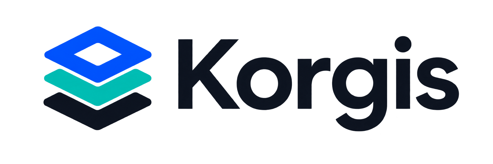

<p align="center">
  
</p>

<h1 align="center">Korgis</h1>

<p align="center">
  <strong>Your AI. Local. Ready to use.</strong>
</p>

<p align="center">
  Resource-aware local AI control plane and evaluation harness.
</p>

<p align="center">
  Run local text, vision and transcription models behind one application-facing API, while the Local LLM Server implementation owns runtime lifecycle, multi-model residency, resource admission, scheduling, privacy, observability and reproducible evaluation.
</p>

<p align="center">
  <a href="#try-it-in-3-minutes">Quick start</a>
  · <a href="#use-your-own-local-gguf">Use your own model</a>
  · <a href="#run-multiple-models-at-once">Multi-model</a>
  · <a href="#test-the-product">Test the product</a>
  · <a href="docs/getting-started.md">Detailed guide</a>
  · <a href="docs/README.md">Architecture & docs</a>
</p>

**Korgis** is the product and bundled browser control-plane identity. **Local LLM Server** remains the repository/package and technical implementation identity; CLI commands, environment variables and HTTP/API contracts are intentionally unchanged.

The project orchestrates specialist inference engines; it does not replace them. `llama.cpp`, `llama-cpp-python`, MLX and task-specific runtimes execute models. Local LLM Server owns the control-plane concerns around them.

> **Current evidence boundary:** the representative Apple Silicon campaign has accepted the target-Mac TH-E1, EV-3, HE-2 and RES-2 minimum-L2 hardware bundle, plus repeated RRG-5 multi-model residency/concurrency/lifecycle evidence. Those observations are claim-scoped to the exercised hardware/models/procedure. They do **not** authorize automatic pressure eviction or a general reclamation/production-safety claim. Automatic pressure-triggered eviction remains disabled; manual accessibility and representative-user usability evidence remain pending.

## Try it in 3 minutes

### 1. Prepare the checkout

From the repository:

```bash
git switch dev
git pull

python3 -m pip install 'uv==0.8.13'
uv sync --frozen --extra dev
```

If `uv` is already installed at the repository-pinned version, only the last command is needed.

### 2. Start a model

The built-in registry includes a small GGUF option:

```bash
uv run --frozen local-llm models
uv run --frozen local-llm download nemotron-nano-4b

uv run --frozen local-llm serve \
  --model nemotron-nano-4b \
  --enable-admin-api \
  --no-download
```

The server binds to loopback by default. When startup completes, open:

**http://127.0.0.1:1235/**

Useful local surfaces:

| Surface | URL | What it is for |
| --- | --- | --- |
| Korgis | `http://127.0.0.1:1235/` | Use and inspect the local AI control plane |
| Integration examples | `http://127.0.0.1:1235/example` | Copy-ready API examples |
| Swagger | `http://127.0.0.1:1235/docs` | Explore the HTTP contract |
| Health | `http://127.0.0.1:1235/health` | Basic readiness |
| Runtime identity | `http://127.0.0.1:1235/v1/runtime/identity` | Stable path-free execution identity |
| Runtime status | `http://127.0.0.1:1235/status` | Live mutable runtime state |

### 3. Try the main product loop

Inside Korgis:

1. **Overview** — confirm the server is healthy and see current capacity/residency.
2. **Models & Runtimes** — inspect configured vs resident models and lifecycle state.
3. **Playground** — send a real prompt to the resident model.
4. **Benchmark & Evaluation** — run a built-in evaluation and inspect evidence/results.
5. **System / Diagnostics** — inspect resource, scheduler, runtime identity and policy evidence.
6. **Settings** — inspect the effective local policy/configuration.

That is the shortest end-to-end product smoke test.

### 4. Verify the API directly

```bash
curl -s http://127.0.0.1:1235/health

curl -s http://127.0.0.1:1235/v1/chat/completions \
  -H 'Content-Type: application/json' \
  -d '{
    "model": "nemotron-nano-4b",
    "messages": [{"role": "user", "content": "Reply with the single word OK."}],
    "temperature": 0
  }'
```

The public text API is OpenAI-compatible.

## Use your own local GGUF

You do not need to add a model to the registry just to try one local GGUF file.

```bash
MODEL_PATH="/absolute/path/to/model.gguf"

uv run --frozen local-llm serve \
  --model my-local-model \
  --model-path "$MODEL_PATH" \
  --backend llama_cpp \
  --enable-admin-api \
  --no-download
```

For the managed external `llama_server` backend on macOS, use an attributable llama.cpp executable at or above the repository feature floor (`v0.3.0` / build `10621`):

```bash
brew install llama.cpp
export LOCAL_LLM_SERVER_BIN="$(command -v llama-server)"

uv run --frozen local-llm serve \
  --model my-local-model \
  --model-path "$MODEL_PATH" \
  --backend llama_server \
  --llama-server-bin "$LOCAL_LLM_SERVER_BIN" \
  --enable-admin-api \
  --no-download
```

Local LLM Server verifies the selected managed executable rather than silently replacing it. A validated build/commit identity is reused only while that executable remains unchanged.

## Run multiple models at once

Multiple long-lived models should be configured through the model registry so each runtime owns its own source/configuration.

User overrides live at:

```text
~/.local-llm/models.yaml
```

Example with two local GGUF files:

```yaml
models:
  local-small:
    model_id: local/small
    path: /absolute/path/to/small.gguf
    backend: llama_server
    quantization: Q4
    modalities: [text]
    multimodal: false

  local-medium:
    model_id: local/medium
    path: /absolute/path/to/medium.gguf
    backend: llama_server
    quantization: Q4
    modalities: [text]
    multimodal: false
```

Then start both:

```bash
export LOCAL_LLM_SERVER_BIN="$(command -v llama-server)"

uv run --frozen local-llm serve \
  --models local-small local-medium \
  --default-model local-small \
  --backend llama_server \
  --llama-server-bin "$LOCAL_LLM_SERVER_BIN" \
  --enable-admin-api \
  --no-download
```

Local LLM Server keeps these concepts separate:

```text
artifact != configured model != resident runtime != default route
```

Each managed subprocess receives a concrete positive loopback port that is checked for host availability. Cross-runtime execution and configured resident/transient accounting remain control-plane owned; backend-native batching/KV stays backend owned.

## Use it from an application

### OpenAI Python SDK

```python
from openai import OpenAI

client = OpenAI(
    base_url="http://127.0.0.1:1235/v1",
    api_key="local",
)

response = client.chat.completions.create(
    model="nemotron-nano-4b",
    messages=[{"role": "user", "content": "Extract decisions and action items."}],
    temperature=0,
)

print(response.choices[0].message.content)
```

`api_key="local"` only satisfies SDK construction; the normal loopback API does not currently require authentication.

### Transcription

When an explicitly transcription-capable runtime is resident:

```bash
curl http://127.0.0.1:1235/v1/audio/transcriptions \
  -F "model=my-asr-runtime" \
  -F "file=@meeting.wav"
```

Unsupported task/modality combinations fail before backend execution on supported product entrypoints.

## Test the product

There are three different test levels. Do not confuse them.

### A. Manual product smoke

Start the server with `--enable-admin-api`, open Korgis and check:

- Overview reports healthy/capacity state;
- Playground returns a real completion;
- Models & Runtimes can show/load/unload supported runtimes;
- a built-in evaluation completes and is inspectable;
- System / Diagnostics reports source-backed runtime/resource evidence;
- after stopping the server, no project-owned listener should remain.

For multi-model testing, use the registry example above and verify both models are simultaneously resident and individually routable.

### B. Deterministic repository tests

Canonical contributor checks:

```bash
uv run --frozen ruff check src/ tests/ --select E9,F63,F7,F82
uv run --frozen pytest tests/ -v --tb=short
```

Browser/product E2E:

```bash
npm ci --ignore-scripts --no-audit --no-fund
npm run test:e2e
python tests/e2e/verify_residue.py
```

These deterministic tests validate contracts and assembled product workflows. They are not a substitute for target-device hardware evidence.

### C. Representative-device evidence

Hardware-dependent lifecycle/resource claims use the bounded procedures in:

[`docs/device-evidence-runbook.md`](docs/device-evidence-runbook.md)

The accepted target-Mac campaign includes repeated load/infer/unload evidence and multi-model RRG-5 observations, while preserving memory deltas as observations rather than automatic safety claims.

## What is integrated

### Control plane

- Korgis with Overview, Models & Runtimes, Endpoints, Playground, Benchmark & Evaluation, System / Diagnostics and Settings;
- explicit configured/resident/default-route state;
- runtime pin/unpin and explicit LRU/TTL administrative eviction paths;
- capability-driven text, image, structured-generation and transcription controls;
- source-backed resource, scheduler, identity and policy evidence.

### Runtime and resource policy

- multiple resident runtimes behind one public HTTP server;
- active leases that protect in-flight work from unload;
- resident + transient configured memory reservation/accounting;
- bounded request admission and optional global cross-runtime execution governor;
- fail-conservative lifecycle and cleanup behavior;
- automatic pressure-triggered eviction deliberately disabled.

### Evaluation and identity

- public path-free `local-llm-identity-v1` execution identity;
- deterministic built-in and validated custom evaluation sets;
- persisted local run history;
- compatibility-aware baseline/candidate comparison;
- no automatic “better model” verdict across incompatible evidence.

## Backend matrix

| Backend | Model format | Execution | Intended workload |
| --- | --- | --- | --- |
| `llama_cpp` | GGUF | in-process `llama-cpp-python` | text / structured reasoning |
| `mlx` | MLX | in-process MLX | Apple Silicon text |
| `llama_server` | GGUF + optional `mmproj` | managed `llama-server` subprocess | GGUF text/multimodal |
| `mlx_vlm_server` | MLX VLM package | managed subprocess | Apple Silicon vision-language |
| explicit ASR runtime | backend-specific | resident adapter | audio → text |

Capabilities are explicit runtime metadata. A backend entry does not imply that every model supports every task.

## HTTP API

Public surface:

| Method | Path | Purpose |
| --- | --- | --- |
| `GET` | `/health` | readiness |
| `GET` | `/status` | mutable runtime/inference status |
| `GET` | `/v1/runtime/identity` | stable path-free execution identity |
| `GET` | `/v1/models` | resident models |
| `POST` | `/v1/chat/completions` | OpenAI-compatible chat/SSE |
| `POST` | `/v1/audio/transcriptions` | audio → text |
| `GET` | `/` | Korgis browser control plane |
| `GET` | `/example` | integration examples |
| `GET` | `/docs` | Swagger |

With `--enable-admin-api`, Korgis additionally uses control-plane routes for registry/runtime lifecycle, resources, evidence, scheduler/policy state, residency and evaluation.

Swagger is the executable schema for the checked-out revision.

## Security defaults

The supported product defaults are local and fail-conservative:

- loopback `127.0.0.1` bind;
- CORS disabled unless explicitly configured;
- admin APIs disabled unless explicitly enabled;
- remote HTTP(S) media disabled by default;
- remote model/tokenizer code requires explicit trust;
- no silent cloud-inference fallback;
- shareable evidence and public identity omit private paths and prompt/output content.

Binding outside loopback broadens the trust boundary. The server does not currently provide authentication, so do not expose administrative routes to an untrusted network.

## How the pieces fit

```text
application / Korgis / evaluator
                  |
                  v
       supported product HTTP stack
                  |
     canonical request + policy boundary
                  |
       scheduler / runtime resolution
                  |
     resident runtime lease + resources
                  |
        specialist backend engine
                  |
      normalized output + evidence
```

Local LLM Server owns policy and lifecycle around specialist inference engines rather than reimplementing inference.

## Documentation

Start here when you need more detail:

- [`docs/getting-started.md`](docs/getting-started.md) — detailed install/start/verification path;
- [`docs/configuration-reference.md`](docs/configuration-reference.md) — CLI/env/registry precedence and configuration;
- [`docs/http-api-reference.md`](docs/http-api-reference.md) — HTTP semantics;
- [`docs/runtime-status-reference.md`](docs/runtime-status-reference.md) — mutable runtime telemetry;
- [`docs/runtime-identity-api.md`](docs/runtime-identity-api.md) — `local-llm-identity-v1`;
- [`docs/architecture.md`](docs/architecture.md) — current architecture and ownership;
- [`docs/current-state.md`](docs/current-state.md) — current integrated/evidence state;
- [`docs/roadmap.md`](docs/roadmap.md) — remaining milestones;
- [`docs/device-evidence-runbook.md`](docs/device-evidence-runbook.md) — representative hardware procedures;
- [`docs/README.md`](docs/README.md) — documentation map.

## License

Released under the MIT License as declared in `pyproject.toml`.
