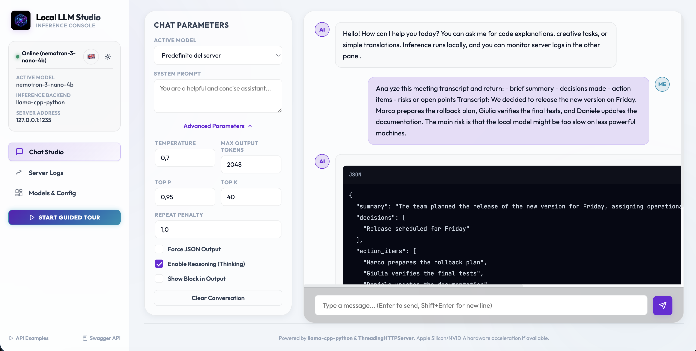
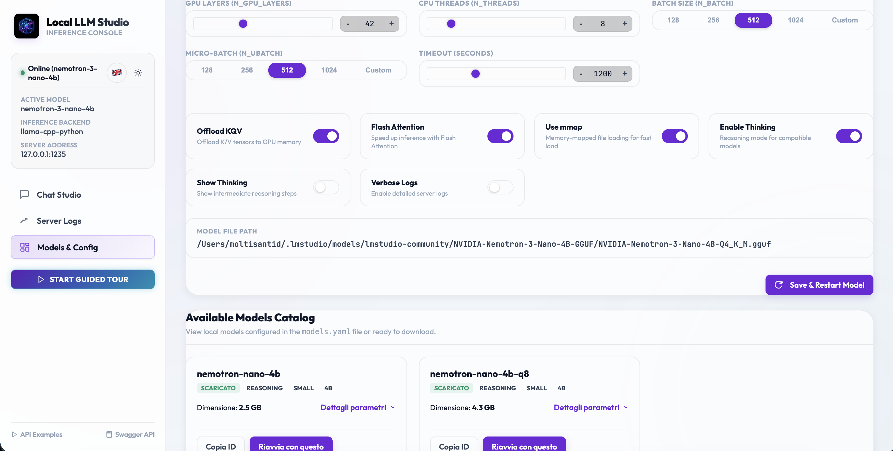
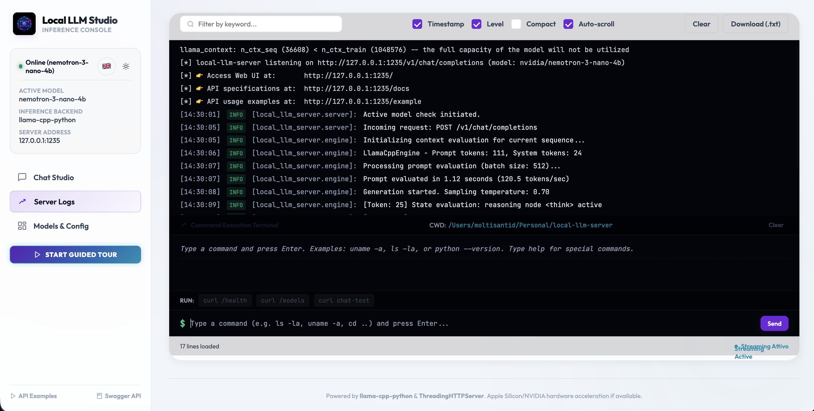
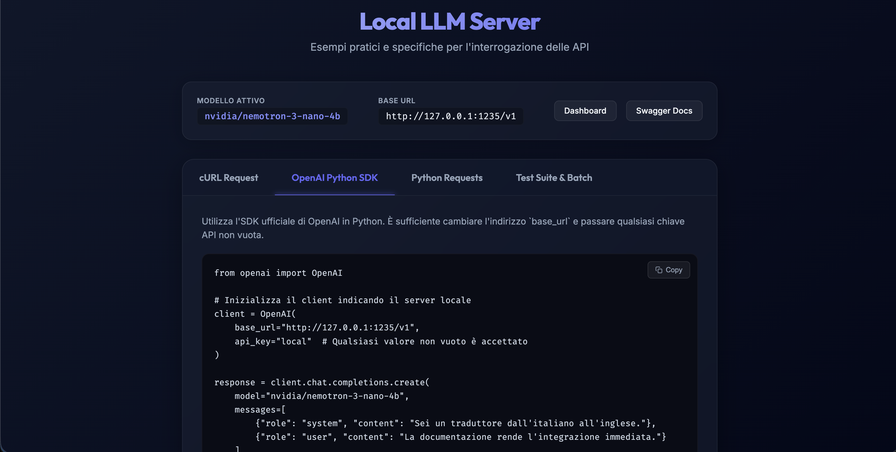
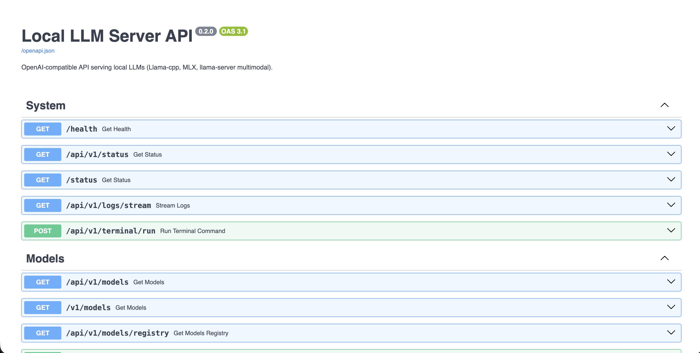

<p align="center">
  
</p>

<h1 align="center">Local LLM Server</h1>

<p align="center">
  <strong>Resource-aware local AI control plane for product-grade inference.</strong>
</p>

<p align="center">
  One application-facing contract for text, vision and audio workloads, with explicit runtime lifecycle, model identity, privacy boundaries, observability and evaluation across specialist local inference backends.
</p>

<p align="center">
  <a href="https://daniele21.github.io/#infrastructure">Local-first AI stack</a>
  ·
  <a href="docs/assets/local-llm-server%20demo.mp4">Guided product tour</a>
  ·
  <a href="#common-workflows">Quick start</a>
  ·
  <a href="#http-api">HTTP API</a>
  ·
  <a href="docs/README.md">Architecture & roadmap</a>
</p>

`local-llm-server` gives applications one stable integration boundary without coupling product code to model files, inference engines, or backend processes. Suitable workloads execute on user-owned hardware by default; external execution remains an explicit architectural choice rather than a hidden runtime dependency.

The product **orchestrates specialist inference runtimes; it does not try to replace them**. `llama.cpp`, MLX and future task-specific engines remain responsible for model execution. Local LLM Server owns the control-plane concerns around them: task contracts, runtime lifecycle, resource admission, routing, privacy policy, observability and reproducible evaluation.

The server is the infrastructure layer. **Local LLM Studio** is the bundled Web control-plane UI for exercising requests, inspecting models/runtimes, viewing diagnostics and progressively managing the same lifecycle exposed through the API.

> **Current vs target:** the repository already provides multi-backend local inference, explicit runtime loading/unloading, OpenAI-compatible chat, multimodal routing and diagnostics. Resource-budget admission, canonical task APIs, evidence-grade runtime fingerprints and the redesigned control-plane UX are active roadmap work, not claims about the current release.

## Product in practice

### Local LLM Studio

Exercise real prompts against resident models, tune supported inference parameters and inspect runtime behavior from the same local surface used for model management and diagnostics.

<p align="center">
  
</p>

<table>
  <tr>
    <td width="50%" valign="top">
      <strong>Models and runtime configuration</strong><br><br>
      Inspect the local catalog, load or switch models, and apply only the parameters supported by the selected backend.<br><br>
      
    </td>
    <td width="50%" valign="top">
      <strong>Live server diagnostics</strong><br><br>
      Follow model loading, prompt evaluation, generation and runtime status through the administrative diagnostics surface.<br><br>
      
    </td>
  </tr>
  <tr>
    <td width="50%" valign="top">
      <strong>Copy-ready integration examples</strong><br><br>
      Move from the console to an application with ready-to-run cURL, Python, JavaScript and Swift examples.<br><br>
      
    </td>
    <td width="50%" valign="top">
      <strong>Interactive API contract</strong><br><br>
      Explore request schemas and execute endpoints directly through the bundled Swagger UI.<br><br>
      
    </td>
  </tr>
</table>

## Product principles

- **Local-first, not local-only:** suitable workloads run on private, user-owned hardware; external execution may exist only as an explicit policy and integration choice.
- **Orchestration, not backend replacement:** specialist engines own inference implementation; the control plane owns stable lifecycle, policy and evidence around them.
- **Stable application contract:** applications integrate through the public HTTP/Python boundary rather than backend-specific inference code.
- **Explicit model routing:** every request resolves a configured model key or model ID; the server does not silently substitute another model.
- **Model artifact ≠ runtime:** downloaded/available, selected/default and resident are deliberately different states.
- **Source-backed observability:** measured, estimated and configured values must remain distinguishable; unavailable data is not rendered as zero.
- **Privacy by default:** loopback binding, disabled CORS/admin endpoints and fail-closed remote behavior are preferred defaults.
- **Evidence before optimization claims:** performance and resource defaults should come from reproducible benchmark evidence on representative hardware.
- **Reusable infrastructure:** downstream products consume Local LLM Server through explicit integration points rather than application-specific state hidden inside the core package.

## Repository map

```text
src/local_llm_server/server.py          FastAPI app, OpenAI-compatible routes, admin API and Web UI
src/local_llm_server/runtime.py         Resident runtime ownership, leases, routing and shutdown
src/local_llm_server/engine.py          llama.cpp, MLX, llama-server and MLX-VLM engine adapters
src/local_llm_server/process.py         Managed subprocess lifecycle and bounded log draining
src/local_llm_server/model_sources.py   LM Studio, Hugging Face cache and download resolution
src/local_llm_server/registry.py        Built-in/user registry loading and validation
src/local_llm_server/config.py          CLI, environment and per-model configuration resolution
src/local_llm_server/core/              Backend-neutral task/request/result contracts (migration in progress)
src/local_llm_server/client.py          High-level Python client for text, image and audio tasks
src/local_llm_server/static             Local LLM Studio frontend and guided tour
src/local_llm_server/models_registry.yaml
                                        Built-in model definitions and runtime defaults
docs                                    Canonical target, current state, roadmap, UX and completion policy
tests                                   Runtime, API, source-resolution and lifecycle regression tests
.github/workflows                       Lint, multi-version test and release automation
```

The target ownership map and migration boundaries live in [`docs/architecture-evolution-plan.md`](docs/architecture-evolution-plan.md). The repository is intentionally migrating incrementally rather than performing a cosmetic one-shot directory rewrite.

## Request resolution

Current compatible path:

```text
OpenAI-compatible request
        model key or model ID
                 ↓
       ModelRuntimeManager.resolve
                 ↓
          resident runtime lease
                 ↓
      per-runtime admission semaphore
                 ↓
        engine.complete or engine.stream
                 ↓
     OpenAI-compatible response or SSE
```

Target control-plane path adds a backend-neutral task/request contract and explicit resource/scheduling policy ahead of backend execution while retaining `/v1/chat/completions` as a compatibility adapter.

The runtime lease prevents `unload`, reload or shutdown from closing an engine while inference is active. Admission is enforced independently per runtime, so requests for different resident models can progress concurrently while each backend retains its own safe concurrency limit.

## Model lifecycle

```text
built-in registry + optional external registries + ~/.local-llm/models.yaml
                  ↓
       validated model definition
                  ↓
 complete LM Studio model → complete Hugging Face cache → explicit download
                  ↓
      artifact completeness validation
                  ↓
            backend engine load
                  ↓
             resident runtime
                  ↓
      explicit default-route selection
                  ↓
          request drain and unload
```

A downloaded model is not automatically resident. A resident model is not automatically the default route. Changing the default route does not unload any other model.

Incomplete MLX snapshots, missing GGUF multimodal projectors, invalid aliases, unsupported backends and inconsistent modality declarations fail before inference begins. Use `--no-download` when startup must remain strictly offline and fail if required artifacts are absent.

## Backend matrix

| Backend | Model format | Execution | Intended workload |
|---|---|---|---|
| `llama_cpp` | GGUF | In-process through `llama-cpp-python` | Text generation and structured local reasoning |
| `mlx` | MLX | In-process through `mlx-lm` | Apple Silicon-optimized text inference |
| `llama_server` | GGUF + optional `mmproj` | Managed `llama-server` subprocess | GGUF multimodal and audio-capable models |
| `mlx_vlm_server` | Complete MLX VLM package | Managed `mlx_vlm.server` subprocess | Apple Silicon vision-language inference |

The control-plane contract is backend-neutral, but backend capabilities remain explicit. Extensibility is not a claim of universal model support.

## Current integrated baseline

The current baseline includes:

- OpenAI-compatible chat completions with streaming and non-streaming responses;
- model selection through the request `model` field, registry key or configured model ID;
- multiple resident runtimes behind one public HTTP port;
- independent runtime admission, active-request leases, safe unload and bounded shutdown;
- GGUF text, MLX text, GGUF multimodal and MLX vision engine adapters;
- centralized local artifact discovery, completeness checks and explicit downloads;
- configurable context, GPU, CPU, batch, timeout, thinking and backend-specific controls;
- a bounded response cache for deterministic greedy completions;
- an interactive Web UI with chat, model configuration, live logs, examples and Swagger docs;
- an opt-in administrative surface for model lifecycle and log streaming;
- isolated FastAPI app instances for safe programmatic embedding;
- a Python client with structured text, local image and audio helpers.

For the authoritative integrated state, blockers and immediate next implementation block, read [`docs/current-state.md`](docs/current-state.md). Do not infer completed capabilities from roadmap entries.

## Active roadmap priorities

The current program is sequenced around six parallel lanes. The most important near-term outcomes are:

1. **Trustworthy foundation:** blocking CI, fail-closed privacy defaults and removal of consumer-specific registry coupling.
2. **Canonical task contract:** backend-neutral chat, structured-generation, vision-language and transcription vocabulary while preserving OpenAI compatibility.
3. **Resource-aware lifecycle:** truthful resource observation, a central ResourceManager, verifiable reclamation and eventually a zero-resident state.
4. **Evidence-grade observability:** precise metric vocabulary, artifact/runtime fingerprinting and reproducible benchmark identity.
5. **Control-plane UX:** redesign around Overview, Models & Runtimes, Endpoints/Playground, Diagnostics and Benchmark & Evaluation using source-backed state only.
6. **Evaluation harness:** reproducible datasets, run identity, comparisons and regression gates tied to exact artifact/runtime configuration.

The dependency graph and parallel batches are maintained in [`docs/roadmap.md`](docs/roadmap.md).

## Build prerequisites

- Python 3.10 or newer
- macOS or Linux
- A C/C++ build toolchain when `llama-cpp-python` must be compiled locally
- Apple Silicon for the `mlx` and `vision` extras
- A `llama-server` binary for the external GGUF multimodal backend
- Enough RAM or unified memory for every model kept resident at the same time

## Installation

Install the default GGUF text backend from source:

```bash
pip install .
```

Install development tools or optional backends as needed:

```bash
pip install ".[dev]"       # pytest, httpx and ruff
pip install ".[mlx]"       # Apple Silicon text models
pip install ".[vision]"    # Apple Silicon vision-language models
pip install ".[audio]"     # local audio preprocessing helpers
```

For editable development with all extras:

```bash
pip install -e ".[dev,mlx,vision,audio]"
```

## Common workflows

List the merged model catalog:

```bash
local-llm models
```

Download a configured model without starting a server:

```bash
local-llm download nemotron-nano-4b-q8
```

Start one model and enable the full Local LLM Studio administrative experience:

```bash
local-llm serve \
  --model nemotron-nano-4b-q8 \
  --enable-admin-api
```

The default runtime is available at:

```text
Web UI       http://127.0.0.1:1235/
API examples http://127.0.0.1:1235/example
Swagger UI  http://127.0.0.1:1235/docs
Health      http://127.0.0.1:1235/health
```

Start a text model and a vision model as concurrent resident runtimes:

```bash
local-llm serve \
  --models nemotron-nano-4b-q8 qwen3-vl-4b \
  --default-model nemotron-nano-4b-q8 \
  --enable-admin-api
```

The current Studio selector lists resident models only. The Models/Config view can load another configured model, change the default route, restart one runtime with new settings or unload an idle model without stopping the server. The roadmap separates future artifact, runtime and resource-budget states more explicitly.

## Client integration

Send a standard chat completion:

```bash
curl http://127.0.0.1:1235/v1/chat/completions \
  -H "Content-Type: application/json" \
  -d '{
    "model": "nemotron-nano-4b-q8",
    "messages": [
      {"role": "user", "content": "Summarize the case for local-first AI."}
    ],
    "temperature": 0
  }'
```

Use the standard OpenAI Python SDK against the local endpoint:

```python
from openai import OpenAI

client = OpenAI(
    base_url="http://127.0.0.1:1235/v1",
    api_key="local",
)

response = client.chat.completions.create(
    model="nemotron-nano-4b-q8",
    messages=[
        {"role": "user", "content": "Extract the decisions and action items."}
    ],
)

print(response.choices[0].message.content)
```

Or use the bundled high-level client:

```python
from local_llm_server import LocalLLMClient

client = LocalLLMClient(
    base_url="http://127.0.0.1:1235",
    model="nemotron-nano-4b-q8",
)

result = client.analyze_text(
    "The team approved the Friday release. Marco owns rollback preparation.",
    language="en",
)

print(result["summary"])
```

Programmatic server ownership is also available through `local_llm_server.serve(...)`, which returns a handle with an explicit `shutdown()` method when started in background mode.

## Runtime configuration

Built-in definitions live in `src/local_llm_server/models_registry.yaml`. Extend or override them locally in `~/.local-llm/models.yaml`:

```yaml
models:
  my-model:
    filename: my-model-Q4_K_M.gguf
    url: https://huggingface.co/example/my-model/resolve/main/my-model-Q4_K_M.gguf
    model_id: example/my-model
    backend: llama_cpp
    thinking_mode: switchable
    params:
      ctx_size: 8192
      n_gpu_layers: 35
      max_concurrent_requests: 1
    tags: [instruct, custom]
```

Consumer applications that need additional registry data should provide it through the generic external-registry integration point rather than relying on application-specific paths inside the core package.

CLI flags override environment variables, which override model and registry defaults. Run `local-llm serve --help` for the complete configuration surface.

## HTTP API

The public runtime surface is available by default:

| Method | Path | Purpose |
|---|---|---|
| `GET` | `/health` | Server, backend, runtime and readiness metadata |
| `GET` | `/status` | Current inference status and telemetry |
| `GET` | `/v1/models` | OpenAI-compatible resident model list |
| `POST` | `/v1/chat/completions` | OpenAI-compatible chat completion and SSE streaming |
| `GET` | `/` | Local LLM Studio |
| `GET` | `/example` | Copy-ready client examples |
| `GET` | `/docs` | Interactive Swagger documentation |

The following routes exist only when `--enable-admin-api` or `serve(enable_admin_api=True)` is set:

| Method | Path | Purpose |
|---|---|---|
| `GET` | `/api/v1/models/registry` | Full configured model catalog |
| `POST` | `/api/v1/models/load` | Load an additional resident runtime |
| `POST` | `/api/v1/models/activate` | Load or select the default runtime |
| `DELETE` | `/api/v1/models/{model}` | Unload one idle runtime |
| `GET` | `/api/v1/logs/stream` | Live server logs over SSE |

## Security boundary

The default bind address is `127.0.0.1`, CORS is disabled, and model-management/log endpoints are excluded unless explicitly enabled. The hardening direction is fail-closed: model code execution and remote media should require explicit policy rather than being silently enabled by a backend.

Binding to `0.0.0.0` exposes the public inference and status routes to the network:

```bash
local-llm serve \
  --host 0.0.0.0 \
  --port 1235 \
  --model nemotron-nano-4b-q8
```

The server does not currently include authentication. Use a host firewall or trusted local reverse proxy and do not enable the administrative API on an untrusted network.

## Validation

Run the automated test suite and linter:

```bash
pytest tests/ -v --tb=short
ruff check src/ tests/
```

Run batch inference verification against an already running server:

```bash
uv run python test_inference.py \
  --server-url http://127.0.0.1:1235/v1
```

Changes to engine, resource or process lifecycle should additionally be checked on representative hardware. Host/unit/emulator-style evidence is useful for merge readiness but must not be represented as physical-hardware performance evidence.

## Documentation and ecosystem

- [`docs/README.md`](docs/README.md) routes the canonical repository documentation.
- [`docs/current-state.md`](docs/current-state.md) is the operational ledger for what is integrated, blocked and next.
- [`docs/roadmap.md`](docs/roadmap.md) owns capability sequencing, dependencies and parallel batches.
- [`docs/architecture-evolution-plan.md`](docs/architecture-evolution-plan.md) owns the target control-plane architecture.
- [`docs/ux-ui-implementation-plan.md`](docs/ux-ui-implementation-plan.md) owns target product-surface behavior.
- The [Android Local LLM Harness](https://github.com/daniele21/android-local-llm-harness) provides the documentation-governance and explicit lifecycle precedent used by this repository.
- Reference applications validate the stack against real product workflows without owning core runtime policy.

## License

Released under the MIT License as declared in `pyproject.toml`.
